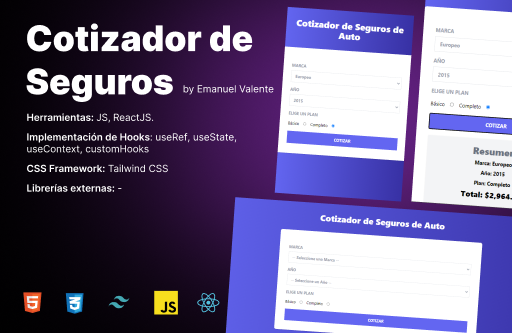

# Cotizador de Seguros

Proyecto creado para el curso de React del profesor Juan de la Torre Valdez en Udemy.

Es un cotizador de planes de seguros para automoviles donde el usuario puede seleccionar el tipo de automovil, el modelo (año) y el tipo de plan aplicable y obtendrá una cotización calculada de acuerdo a estos factores.

Enlace hacia el deploy: https://cotizador-react-eight.vercel.app/
